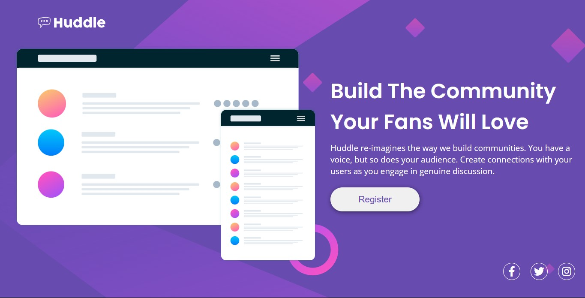

# Desafio HTML + CSS avançado - DevQuest



## ✨ Sobre o Desafio

Usei meus conhecimentos aprendidos nos módulos de HTML e CSS Avançado do Curso de Desenvolvimento Web Fullstack DevQuest - Dev em Dobro para concluir a quest que foi baseada no desafio do Frontend Mentor.

> 🔗 Link do Desafio: [Huddle landing page with a single introductory section](https://www.frontendmentor.io/challenges/huddle-landing-page-with-a-single-introductory-section-B_2Wvxgi0)

## 📝 Principais Objetivos

- Exibir o layout ideal para a página, dependendo do tamanho da tela do dispositivo

- Ver os estados de foco para todos os elementos interativos na página

## 💻 Tecnologias Utilizadas:


          
## ☕ Como utilizar:

1° Clone o repositório
```
git clone url-do-repositorio
```
2° Ou acesse o deploy do formulário [Clicando aqui](https://fransuelton.github.io/formulario-de-cadastro/).

## Obrigado por visitar meu repositório!❤️